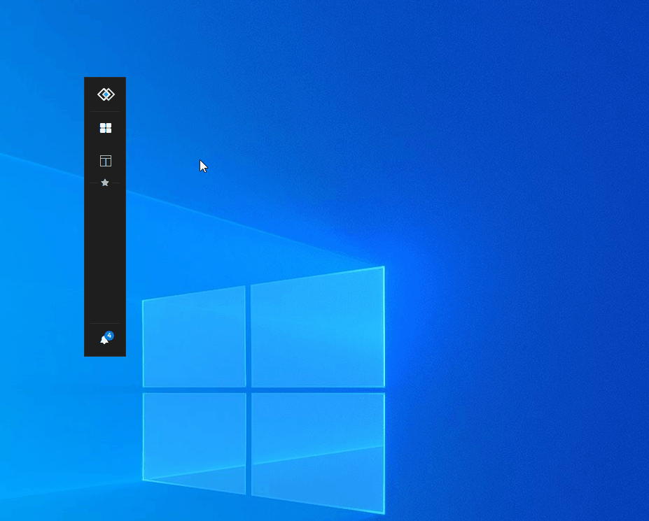

# Glue42 Floating Toolbar

Pure JavaScript implementation of a Glue42 Floating Toolbar for [**Glue42 Enterprise**](https://glue42.com/enterprise/).



For more details, see also the [Glue42 Toolbar documentation](https://docs.glue42.com/glue42-concepts/glue42-toolbar/index.html).

## Prerequisites

None. The code doesn't require any other modules, packages or installations.

## Main Functionalities

- Listing, searching and starting applications.
- Adding and removing applications from favorites.
- Listing, searching and opening [Layouts](https://docs.glue42.com/glue42-concepts/windows/layouts/overview/index.html) (including Global, Swimlane and Workspace layouts).
- Managing basic settings for the Toolbar.
- Changing the Glue42 themes.
- Searching for Clients and Instruments (if available via GSS), listing and starting application that can open the search entity (Client or Instrument).
- Switching between horizontal and vertical views.
- Opening the Glue42 Feedback Form.
- Opening the Glue42 Notifications Panel

## Customizing the Toolbar

You can use the Floating Toolbar source code to create your own modified version of a Glue42 Toolbar. Once you have implemented a toolbar, you must host it, create an [application configuration](https://docs.glue42.com/developers/configuration/application/index.html#application_configuration) file for it and add it to your application store. Make sure to set the `"shell"` top-level key to `true`:

```json
{
    ...
    "shell": true,
    ...
}
```

Also, modify the [system configuration](https://docs.glue42.com/developers/configuration/system/index.html) of **Glue42 Enterprise** from the `system.json` file - set the `"useEmbeddedShell"` property to `false`:

```json
{
    ...
    "useEmbeddedShell": false,
    ...
}
```

Restart **Glue42 Enterprise** for the changes to take effect.
